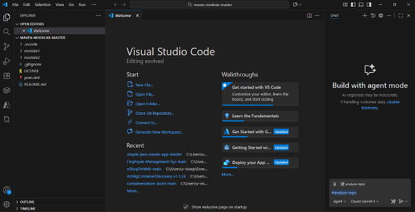
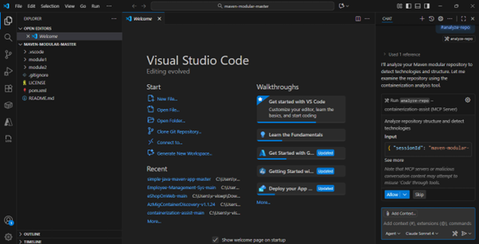
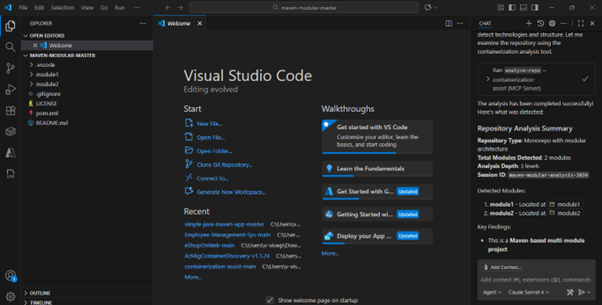
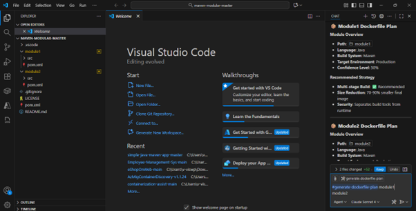
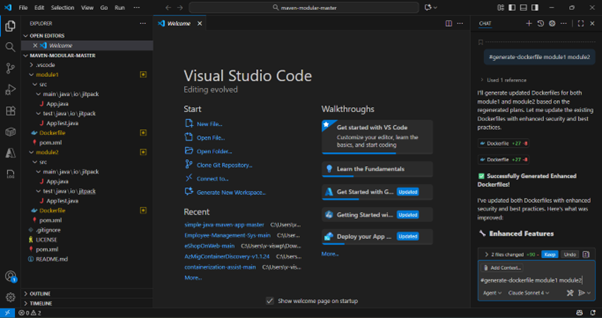
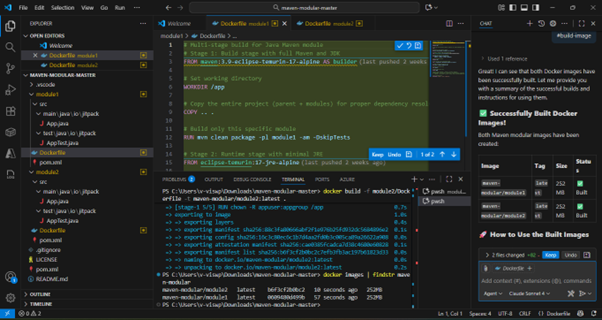
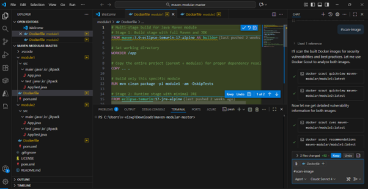
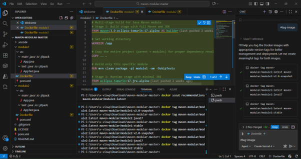
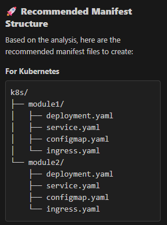
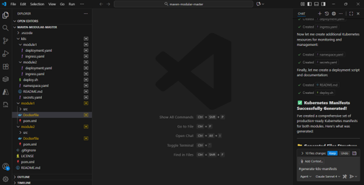

# Containerization Assist - Runbook
*Technical Documentation Version 1.0*

## Document Summary

| Document Item | Current Value |
|--------------|---------------|
| Document Title | FACTORY_Runbook_Containerization Assist_v1.0 |
| Program | CSU Accelerate Factory |
| Date Last Modified | 13-10-2025 |
| Date Last Reviewed | |
| Status | Draft V1.0 |
| Document Description | This document provides guidelines on how to use the Containerization Assist tool. |

## Change Log
This section documents the change history of the document. Revisions must be tracked by identifying a latest version number, the date of modification, the person responsible for the change, and the reason for the change.

| Date | Version | Change Description | Author | Reviewer | Approver |
|------|---------|-------------------|---------|-----------|-----------|
| 13-10-2025 | v1.0 | Initial draft | Viswanatha Selvam P | | |

## Table of Contents
1. [Introduction](#introduction)
   1. [Objective](#objective)
   2. [Intended Audience](#intended-audience)
2. [Key Features of Containerization Assist MCP Server](#key-features-of-containerization-assist-mcp-server)
3. [System Requirements and Prerequisites](#system-requirements-and-prerequisites)
   1. [System Requirements](#system-requirements)
   2. [Supported Technologies](#supported-technologies)
      1. [Languages & Frameworks](#languages--frameworks)
      2. [Build Systems](#build-systems)
4. [App Containerization Workflow](#app-containerization-workflow)
   1. [Single Operator Model](#single-operator-model)
   2. [Containerization Workflow Steps](#containerization-workflow-steps)
5. [MCP Overview & MCP Tools Used](#mcp-overview--mcp-tools-used)
   1. [Overview](#overview)
   2. [MCP Tools Used](#mcp-tools-used)
6. [Container Assist MCP Server Usage](#container-assist-mcp-server-usage)
   1. [VS Code Setup](#vs-code-setup)
   2. [Execution - Containerization Process](#execution---containerization-process)
      1. [Analysis & Planning](#analysis--planning)
      2. [Dockerfile Operations](#dockerfile-operations)
      3. [Image Operations](#image-operations)
      4. [Kubernetes Operations](#kubernetes-operations)
      5. [Utilities](#utilities)

## 1. Introduction
The Containerization Assist MCP Server helps to build, scan, and deploy Docker containers through VS Code and other MCP-compatible tools.

### 1.1. Objective
The objective of this document is to guide engineers, consultants, and other professionals in using the Containerization Assist MCP Server in the process of containerization, image scanning and image deployment to AKS/ACA.

### 1.2. Intended Audience
This document is intended for use by Engineering Teams, Technical Teams, Technical Managers, Architects, Consultants, and Delivery Teams of FACTORY and Microsoft.

## 2. Key Features of Containerization Assist MCP Server
This Containerization Assistant provides a wide range of features which helps in the process of containerization, image scanning and image deployment to AKS/ACA as mentioned below.

- **Docker Integration**: Build, scan, and deploy container images
- **Kubernetes Support**: Generate manifests and deploy applications
- **AI-Powered**: Intelligent Dockerfile generation and optimization
- **Knowledge Enhanced**: AI-driven content improvement with security and performance best practices
- **Intelligent Tool Routing**: Automatic dependency resolution and execution
- **Progress Tracking**: Real-time progress updates via MCP notifications
- **Security Scanning**: Built-in vulnerability scanning with AI-powered suggestions
- **Smart Analysis**: Context-aware recommendations

## 3. System Requirements and Prerequisites

### 3.1. System Requirements
The Container Assist MCP Server needs the below system requirements for it to run on a machine.

- **Node.js**: Version 20 or higher
- **Docker or Docker Desktop**
  - Docker: Running Docker daemon with accessible socket (docker ps should work)
    - Linux/Mac: `/var/run/docker.sock` accessible
    - Windows: Docker Desktop with `//./pipe/docker_engine` accessible
- **Optional**: Trivy (for security scanning features)
- **Optional**: Kubernetes (for deployment features)
  - Valid kubeconfig at `~/.kube/config`
  - Cluster connectivity (`kubectl cluster-info` should work)
  - Appropriate RBAC permissions for deployments, services, namespaces
- **MCP Client**: VS Code with Copilot, Claude Desktop, or another MCP-compatible client
- **GHCP Enterprise License** or Demo account

### 3.2. Supported Technologies

#### 3.2.1. Languages & Frameworks
- Java: Spring Boot, Quarkus, Micronaut (Java 8-21)
- .NET: ASP.NET Core, Blazor (.NET 6.0+)

#### 3.2.2. Build Systems
- Maven, Gradle (Java)
- dotnet CLI (.NET)

## 4. App Containerization Workflow

### 4.1. Single Operator Model
This server is optimized for containerizing one application at a time. Key characteristics:

- Sequential execution: Each tool builds on the results of previous steps
- Fast-fail validation: Clear, actionable error messages if Docker/Kubernetes are unavailable
- Deterministic AI generation: Tools provide reproducible outputs through built-in prompt engineering
- Real-time progress: MCP notifications surface progress updates to clients during long-running operations

### 4.2. Containerization Workflow Steps
This MCP Server helps in the containerization process of a single application at a time. The workflow follows the below sequence of steps:

1. **Analyze Repository** → Understand the application's language, framework, and dependencies
2. **Generate Dockerfile** → Create an optimized, security-hardened container configuration
3. **Build Image** → Compile application into a Docker image
4. **Scan Image** → Identify security vulnerabilities and get remediation guidance
5. **Tag Image** → Apply appropriate version tags to your image
6. **Generate K8s Manifests** → Create deployment configurations for Kubernetes
7. **Prepare Cluster** → Set up namespace and prerequisites (if needed)
8. **Deploy** → Deploy application to Kubernetes
9. **Verify** → Confirm deployment health and readiness

## 5. MCP Overview & MCP Tools Used

### 5.1. Overview
The Model-Context-Protocol (MCP) is a standardized communication interface designed to enhance interoperability between AI language models and external servers. It establishes a structured way for language models to interact with resources, tools, and capabilities provided by external systems.

MCP operates on a client-server model where:
- **Clients**: AI models or applications embedding them
- **Servers**: External systems providing additional capabilities to the models

MCP servers can offer three primary types of capabilities to clients:
- **Resources**: Provide context and data that can be accessed by either the user or the AI model
- **Prompts**: Deliver templated messages and structured workflows for suggested user interactions
- **Tools**: Expose functions that AI models can call to perform specific tasks

### 5.2. MCP Tools Used
Containerization Assist MCP Server provides various MCP tools which can be used in the Containerization process.

| Functions | Tool | Description |
|-----------|------|-------------|
| **Analysis & Planning** | analyze-repo | Analyze repository structure and detect technologies by parsing config files |
| **Dockerfile Operations** | generate-dockerfile | Gather insights from knowledge base and return requirements for Dockerfile creation |
| | fix-dockerfile | Analyze Dockerfile for issues including organizational policy validation and return knowledge-based fix recommendations |
| **Image Operations** | build-image | Build Docker images from Dockerfiles with security analysis |
| | scan-image | Scan Docker images for security vulnerabilities with remediation guidance (uses Trivy CLI) |
| | tag-image | Tag Docker images with version and registry information |
| | push-image | Push Docker images to a registry |
| **Kubernetes Operations** | generate-k8s-manifests | Gather insights and return requirements for Kubernetes/Helm/ACA/Kustomize manifest creation |
| | prepare-cluster | Prepare Kubernetes cluster for deployment |
| | deploy | Deploy applications to Kubernetes clusters |
| | verify-deploy | Verify Kubernetes deployment status |
| **Utilities** | ops | Operational utilities for ping and server status |

## 6. Container Assist MCP Server Usage

### 6.1. VS Code Setup
The below code snippet should be added in VS Code Settings:

```json
{
  "servers": {
    "containerization-assist": {
      "command": "npx",
      "args": ["-y", "containerization-assist-mcp", "start"],
      "env": {
        "DOCKER_SOCKET": "//./pipe/docker_engine",
        "LOG_LEVEL": "info"
      }
    }
  }
}
```

Alternative setup method:
1. Open the project in VS Code which we want to containerize
2. Create a json file as `mcp.json` with the above content
3. Create `.vscode` folder under the project folder
4. Place the `mcp.json` file under `.vscode` folder of the project

Restart VS Code to enable the MCP Server in Github Copilot.

For Linux, use the Linux Docker Pipe:
```json
"DOCKER_SOCKET": "/var/run/docker.sock"
```

### 6.2. Execution - Containerization Process
After enabling the MCP Server by restarting VS Code and opening the project to be containerized, we can use the Github Copilot chat for the containerization process. The MCP tools execution will be sequential as the output of the previous step will be used for the next step.

#### 6.2.1. Analysis & Planning
For analyzing and understanding the project structure and folders, use the `#analyze-repo` tool.

This tool will scan through the complete folder structure of the project and will also detect technologies associated with the project. Then, it will ask for consent about to proceed on the analysis of the project. 
At the end of this tool execution, it presents the details about the project like Repository structure, Technology Stack analysis, Database Support, Dependencies Detected, Containerization Status, Module Configuration, Security & Performance analysis, Containerization Readiness Score and Next Steps Available.


This tool will:
- Scan through the complete folder structure of the project
- Detect technologies associated with the project
- Ask for consent to proceed with the analysis
- Present details about the project including:
  - Repository structure
  - Technology Stack analysis
  - Database Support
  - Dependencies Detected
  - Containerization Status
  - Module Configuration
  - Security & Performance analysis
  - Containerization Readiness Score
  - Next Steps Available

Analyse-Repo GHCP Chatwindow



User Consent in Github Copilot



Github Copilot with analyzed results



#### 6.2.2. Dockerfile Operations

##### 6.2.2.1. Generate Dockerfile

The Dockerfile for the analyzed project, completed in the previous step, can be generated using the #generate-dockerfile-plan MCP tool. This tool creates an optimized Dockerfile tailored to the project’s configuration and requirements. This tool is also supported by multi-module workflows. The multi-modules can be executed as below.

Generate Dockerfile using the `#generate-dockerfile-plan` MCP tool. For multi-module workflows:

```
#generate-dockerfile-plan <Module Name1> <Module Name2> <Module Name3>
```


After reviewing the plan, generate the actual Dockerfile:

```
#generate-dockerfile <Module Name1> <Module Name2> <Module Name3>
```


##### 6.2.2.2. Fix and Validate Dockerfile
Use `#fix-dockerfile` MCP tool to address any issues and perform organizational policy validation.

##### 6.2.2.3. Start the Build Process
Initiate the Dockerfile build process to create the project's container image.

#### 6.2.3. Image Operations

##### 6.2.3.1. Build Docker Images
Use `#build-image` MCP tool to build Docker images with integrated security analysis.



##### 6.2.3.2. Scan Built Images
Use `#scan-image` MCP tool to scan for security vulnerabilities and compliance issues.



##### 6.2.3.3. Tag Scanned Images
Use `#tag-image` MCP tool to assign version details and registry information.

8

##### 6.2.3.4. Push Images to Registry
Use `#push-image` MCP tool to push tagged images to the designated container registry.

#### 6.2.4. Kubernetes Operations

##### 6.2.4.1. Generate Manifests
Generate deployment manifests using:
```
Manifests for various deployment targets — including Kubernetes, Helm, Azure Container Apps (ACA), and Kustomize — can be generated using the #generate-manifest-plan followed by #generate-k8s-manifests MCP tool. This tool automates the creation of configuration files required for deploying applications to different Kubernetes environments. This tool also supports multi-module workflows.

The supported manifest structure from these tools is as below.


#generate-manifest-plan <Module Name1> <Module Name2> <Module Name3>
```

So, the above-mentioned manifest files will be generated as part of these tools.

Followed by:
```

#generate-k8s-manifests <Module Name1> <Module Name2> <Module Name3>
```

Supported manifest structure includes various configuration files for deployment.

##### 6.2.4.2. Prepare a Demo Cluster
Use `#prepare-cluster` MCP tool to provision a demo Kubernetes cluster.

##### 6.2.4.3. Deploy
Use `#mcp_azure_mcp_deploy` MCP tool to deploy the application.

##### 6.2.4.4. Verify Kubernetes Deployment Status
Use `#verify-deploy` MCP tool to confirm successful deployment.

#### 6.2.5. Utilities
Use `#ops` MCP tool to check operation utilities for ping and server status.

## References
- VS Code
- A GitHub account with GitHub Copilot enabled
- GitHub Copilot extension in VS Code
- GitHub Copilot